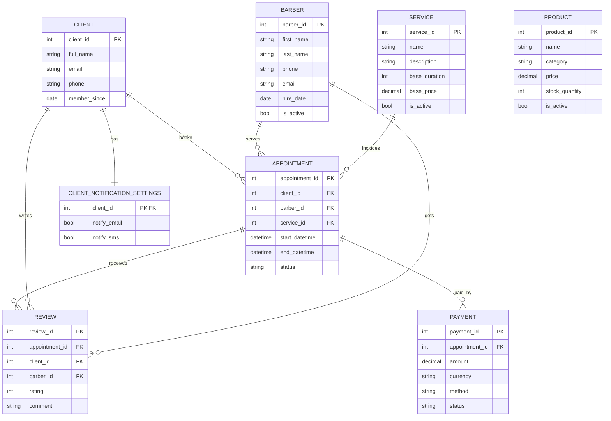

# BarberShop - Database Model (Code First)

## Relational Model Diagram

## Tables included (excluding user/auth tables)

- `CLIENT`
- `BARBER`
- `SERVICE`
- `APPOINTMENT`
- `PRODUCT`
- `CLIENT_NOTIFICATION_SETTINGS`
- `REVIEW`
- `PAYMENT`

## Code First notes

- Entity classes are in `Models/`
- EF Core context is `Data/BarberShopDbContext.cs`
- Connection string is configured in `appsettings.json`
- EF Core is registered in `Program.cs` via `AddDbContext`

### Migration commands (run locally)

- `dotnet tool install --global dotnet-ef`
- `dotnet ef migrations add InitialCreate`
- `dotnet ef database update`
